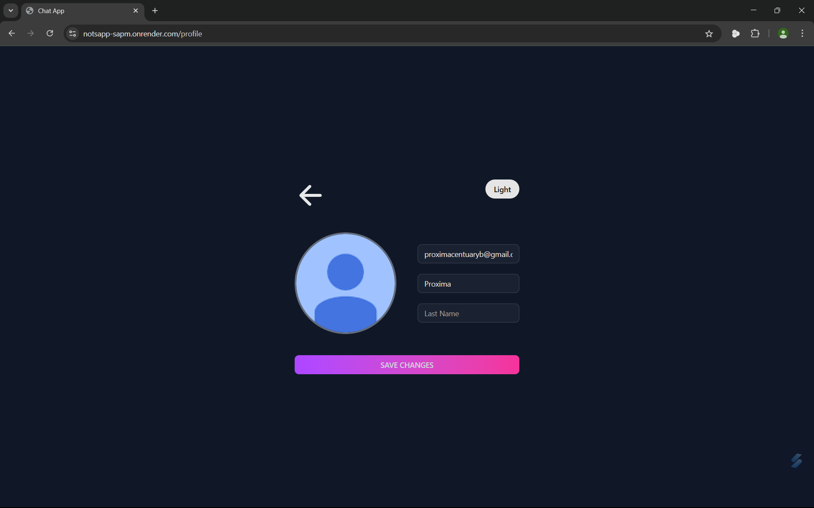
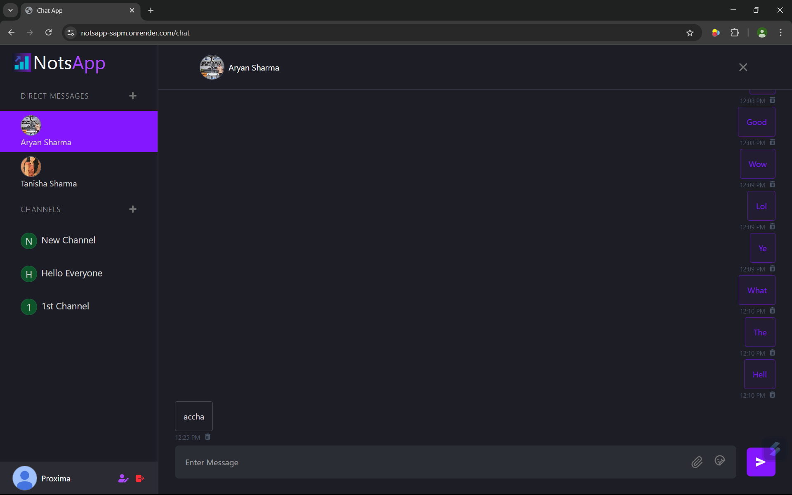
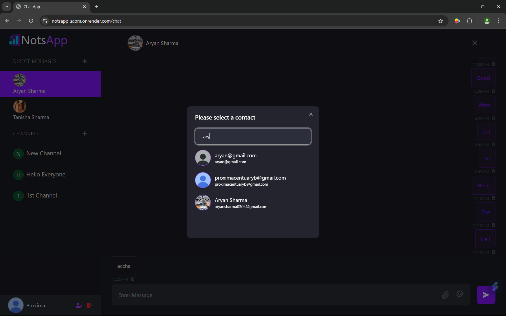

# NotsApp 🚀

A real-time, one-on-one and group chat application built with React, Node.js, Express, and WebSockets. Enables users to register, authenticate, and exchange messages instantly.

Click here to visit the website [NotsApp](https://notsapp-sapm.onrender.com)
---

## 🎯 Features

* **User Authentication** – Sign up, log in, and manage profiles
* **Real-Time Messaging** – Instant message delivery using WebSockets
* **User Presence** – Online/offline status indicators
* **Typing Indicator** – See when someone is typing
* **Message History** – Persistent chat logs

---

## 🛠️ Tech Stack

| Layer          | Technology                  |
| -------------- | --------------------------- |
| Frontend       | React, Redux, CSS/SCSS      |
| Backend        | Node.js, Express, Socket.io |
| Database       | MongoDB                     |
| Authentication | JWT                         |
| Deployment     | Render                      |

---

## 📦 Folder Structure

```
/
├── client/           # Frontend source code
├── server/           # Backend source code
├── .env              # Environment variables (not committed)
├── package.json
└── README.md
```

## 📅 Getting Started (Local Setup)

1. **Clone the repo**

   ```bash
   git clone https://github.com/Tanmay1Nandi/Chat-App.git
   cd Chat-App
   ```

2. **Backend setup**

   ```bash
   cd server
   npm install
   # Create a .env file with your DB and auth credentials
   npm run dev
   ```

3. **Frontend setup**

   ```bash
   cd ../client
   npm install
   npm start
   ```

4. **Open the app**
   Visit `http://localhost:8000`

---

## 🦖 Usage

* Sign up with email/password
* Log in to access chat interface
* Select a user to start chatting
* Send messages and see them in real time

---

## 🎥 Screenshots

### Profile Page



### Personal Chat Interface



### Search New People to Chat



---


### ✅ To Do

* [ ] Implement end-to-end encryption
* [ ] Add group chat feature
* [ ] Integrate push notifications
